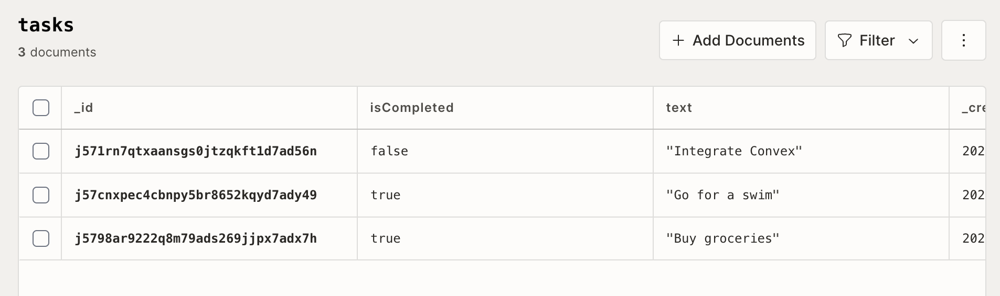
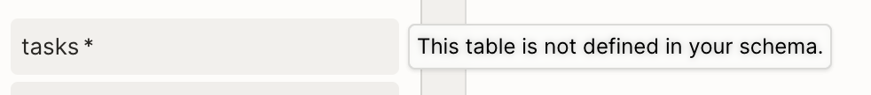

# CFC Studio 共学 FullStack Compass 指引
---
# [your name]

## 笔记证明

<!-- Content_START -->

### 02.03

> 学习时间： 60 min

发起这期共学，我主要是想学一点产品设计相关的内容。之前了解过 `figma` 者应该是比较主流的设计工具，但是在搜集资料时发现了 `framer`，这应该是比较新的工具。

我一向是喜欢尝鲜的，于是准备先学习 `framer` 的内容，先从官方的教程开始。

---

设置字体为 `Material Symbols Rounded`，可以将 `gesture` 转换为 

将 `color` 设置为 `assets`，方便下次使用。

通过点击右上角的加号，可以同时预览多端视图，不需要切换。


修改主视图内容可以影响其他视图，同时也可以单独修改其他视图，以满足多端适配。

将多个组件合并为一个 `stack`，可以通过某种特殊的规则操作它，暂时还没搞明白。

一个小时做了这么个鬼东西。


### 02.04

> 学习时间：60(10) min

调整组件 `position` 属性为 `fixed`，可以避免对 `layout` 内 `stack` 的影响。

添加 `frmaer` 并设置 `width` 属性为 `fill`，可以实现 `spacer` 的效果。


淡入动画需要设置 `Effects` 的 `Appear` 效果。

动画在过程中被截断了，需要将 `Text` 部分的 `Overflow` 设置为 `Visible`。

注意修改之后 `publish` 需要点击 `Update` 才会生效。

最后，成品如下：https://global-lot-758021.framer.app/

### 02.05

> 学习时间：20 min

今天有点忙，只花了一点时间将新手教程浏览完了。

一个好用的插件：`Phosphor` 可以用来查询好看的 `icon`。

一个 `Portfolio` 模版：https://www.framer.com/marketplace/templates/cohesion/

通过 `Chrome` 插件，可以将一个网页直接复制成 `Framer` 项目，cv 工程师狂喜：https://www.framer.com/academy/lessons/html-to-framer 计划明天尝试用来玩玩。

### 02.07

> 学习时间：20 min

尝试之前提到的页面提取插件。

安装插件 `HTML to Framer`，同时注意修改其设置，将“允许访问文件网址”选项打卡才能正常使用。

确实好用，一瞬间就将别人的页面 copy 过来了：https://traditional-surprise-092015.framer.app/


最近在忙工作上的事，今天抽空暂时就做到这。

### 02.13

> 学习时间：60 min

使用里一段时间 `framer` 发现它确实有很多实用的特效和动画效果，但是和 `figma` 想比，它有一个很大的缺点：不能导出成代码。

`framer` 只能通过 publish 的方式发布设计的页面，这很方便，但是依赖 `framer` 官方，且缺少可定制性。

接下来还是回到 `figma` 的使用上吧。

---

字体最好设置在 `16px` 到 `18px` 之间

选择一个 `layer` 使用快捷键 `Shift + a` 可以将 `layer` 转换为 `frame`

将 `frame` 的布局设置为 `Hug` 可以自动适应页面布局

快捷键 `opt + cmd + k` 可以将 `frame` 转换为一个组件

---

创建可交互式组件

命名规则 `button/default/unsaved`

> 为什么要使用斜线分隔的命名系统？
>
> 使用斜杠 ( / ) 构造组件名称可让您快速设置组件的属性值。第一个斜杠之前的任何文本都将成为组件名称，并且每个额外的斜杠级别都会创建一个新属性，该属性将应用于组件集中的所有变体。例如，我们的按钮名称为 button/default/unsaved。
>
> 添加一个变体后，组件集将看起来像：
>
> Component set name: button
>
> Property 1: default
>
> Property 2: unsaved
>
> 要完成配置，我们需要更新属性名称并为组件集中的每个变体添加属性值。


### 02.15

> 学习时间：120 min

cfc-web 项目开始要用到后端了。我暂时懒得去搭建后端服务，决定在 `convex` 和 `sanity` 中选择一个使用，下面是它们之间的对比：

**核心定位**
|工具|类型|主要用途|
|--|--|--|
|Convex|实时后端即服务（BaaS）|提供实时数据库、函数即服务（FaaS）、状态管理，用于快速构建全栈实时应用。|
|Sanity|内容管理系统（CMS）|专注于内容管理和结构化数据存储，提供灵活的内容建模和编辑界面。|

考虑到目前最高优先级是实现表单提交并储存的功能，而 `Sanity` 更适合博客或文档这类的内容管理，于是我决定使用 `Convex`。

但是 `Convex` 也存在一个缺点，它不是开源的，若持续使用可能会产生费用。若需要开源方案可以选择 `Supabase`，但因为之前使用过 `Supabase`，我又想尝试一些新东西，所以还是用用 `Convex` 吧，等到了收费那一步在做迁移吧（虽然迁移难度应该挺大）。

---

**走一遍 Convex 官方的教程**

初始化项目：

```shell
npm install convex

npx convex dev
```

创建实例数据 `sampleData.jsonl`

```jsonl
{"text": "Buy groceries", "isCompleted": true}
{"text": "Go for a swim", "isCompleted": true}
{"text": "Integrate Convex", "isCompleted": false}
```

通过以下方式添加到数据库中：

```shell
npx convex import --table tasks sampleData.jsonl
```

可以在网页中看到数据



通过下面的方式定义一个查询 api，用于查询 tasks 库中的内容。

```typescript
import { query } from "./_generated/server";

export const get = query({
  args: {},
  handler: async (ctx) => {
    return await ctx.db.query("tasks").collect();
  },
});
```

在查询前需要创建一个 provider（常规操作了）

```tsx
"use client";

import { ConvexProvider, ConvexReactClient } from "convex/react";
import { ReactNode } from "react";

const convex = new ConvexReactClient(process.env.NEXT_PUBLIC_CONVEX_URL!);

export function ConvexClientProvider({ children }: { children: ReactNode }) {
  return <ConvexProvider client={convex}>{children}</ConvexProvider>;
}
```

privider 需要包裹在 RootLayout 下：

```tsx
"use client";

import { ConvexProvider, ConvexReactClient } from "convex/react";
import { ReactNode } from "react";

const convex = new ConvexReactClient(process.env.NEXT_PUBLIC_CONVEX_URL!);

export function ConvexClientProvider({ children }: { children: ReactNode }) {
  return <ConvexProvider client={convex}>{children}</ConvexProvider>;
}

{/* */}

import { ThirdwebProvider } from "thirdweb/react";
import { ConvexClientProvider } from "./convex-client-provider";

export function Providers({
  children,
}: Readonly<{
  children: React.ReactNode;
}>) {
  return (
    <ThirdwebProvider>
      <ConvexClientProvider>{children}</ConvexClientProvider>
    </ThirdwebProvider>
  );
}
```

下面是查询的方式

```tsx
"use client";

import Image from "next/image";
import { useQuery } from "convex/react";
import { api } from "../convex/_generated/api";

export default function Home() {
  const tasks = useQuery(api.tasks.get);
  return (
    <main className="flex min-h-screen flex-col items-center justify-between p-24">
      {tasks?.map(({ _id, text }) => <div key={_id}>{text}</div>)}
    </main>
  );
}
```

---

**Convex 数据库概念**

> Convex 数据库采用关系型数据模型设计，支持类 JSON 文档存储，可自由选择是否使用模式定义。其"开箱即用"的特性，通过简洁易用的接口即可实现稳定的查询性能。
>
> 通过轻量级 JavaScript API，您可以直接在查询和变更函数中实现数据读写操作。无需任何配置，无需编写 SQL 语句，仅需使用 JavaScript 即可满足应用程序的所有数据需求。

**Tables**

`Conve`x 中，数据库表不需要事先指定结构，插入内容之后表结构会自行创建。

```ts
// `friends` table doesn't exist.
await ctx.db.insert("friends", { name: "Jamie" });
// Now it does, and it has one document.
```

**Documents**

表中的内容被称为 `Documents`，它是一个 `json` 对象，类似 `mongoDB` 中的数据。

> 这里有一种 .jsonl 文件，我的理解是它是一些又 json 对象组成的列表

```jsonl
{}
{"name": "Jamie"}
{"name": {"first": "Ari", "second": "Cole"}, "age": 60}
```

**Schemas**

若实在需要定义表结构，可以使用 `Schemas`：

```ts
import { defineSchema, defineTable } from "convex/server";
import { v } from "convex/values";

// @snippet start schema
export default defineSchema({
  messages: defineTable({
    author: v.id("users"),
    body: v.string(),
  }),
});
```

---

**写入数据**

使用 `db.insert` 方法在数据库中创建新 `Document`，`insert` 会返回插入结果的 `id`：

```ts
import { mutation } from "./_generated/server";
import { v } from "convex/values";

export const createTask = mutation({
  args: { text: v.string() },
  handler: async (ctx, args) => {
    const taskId = await ctx.db.insert("tasks", { text: args.text });
    // do something with `taskId`
  },
});
```

使用 `db.patch` 方法更新现有 `Document`：

```ts
import { mutation } from "./_generated/server";
import { v } from "convex/values";

export const updateTask = mutation({
  args: { id: v.id("tasks") },
  handler: async (ctx, args) => {
    const { id } = args;
    console.log(await ctx.db.get(id));
    // { text: "foo", status: { done: true }, _id: ... }

    // Add `tag` and overwrite `status`:
    await ctx.db.patch(id, { tag: "bar", status: { archived: true } });
    console.log(await ctx.db.get(id));
    // { text: "foo", tag: "bar", status: { archived: true }, _id: ... }

    // Unset `tag` by setting it to `undefined`
    await ctx.db.patch(id, { tag: undefined });
    console.log(await ctx.db.get(id));
    // { text: "foo", status: { archived: true }, _id: ... }
  },
});
```

使用 `db.delete` 方法删除现有 `Document`：

```ts
import { mutation } from "./_generated/server";
import { v } from "convex/values";

export const deleteTask = mutation({
  args: { id: v.id("tasks") },
  handler: async (ctx, args) => {
    await ctx.db.delete(args.id);
  },
});
```

---

**定义Schemas**

在 `npm convex dev` 启动的情况下，创建 `convex/schema.ts` 文件，会自动在数据库中创建对应的表结构。

```ts
import { defineSchema, defineTable } from "convex/server";
import { v } from "convex/values";

export default defineSchema({
  messages: defineTable({
    body: v.string(),
    user: v.id("users"),
  }),
  users: defineTable({
    name: v.string(),
    tokenIdentifier: v.string(),
  }).index("by_token", ["tokenIdentifier"]),
});
```

同时，在这种情况下使用未在 `schema.ts` 中定义的表会报错（例如在教程中创建的 `tasks` 表）。



> 总结，快速过了一下 convex 的教程，熟悉了插入与查询数据的方式，同时成功在 `cfc-web` 项目中实现报名表单数据的提交。

<!-- Content_END -->
