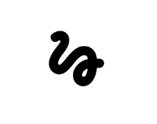

# CFC Studio 共学 FullStack Compass 指引
---
# [your name]

## 笔记证明

<!-- Content_START -->

### 02.03

> 学习时间： 60 min

发起这期共学，我主要是想学一点产品设计相关的内容。之前了解过 `figma` 者应该是比较主流的设计工具，但是在搜集资料时发现了 `framer`，这应该是比较新的工具。

我一向是喜欢尝鲜的，于是准备先学习 `framer` 的内容，先从官方的教程开始。

---

设置字体为 `Material Symbols Rounded`，可以将 `gesture` 转换为 

将 `color` 设置为 `assets`，方便下次使用。

通过点击右上角的加号，可以同时预览多端视图，不需要切换。

修改主视图内容可以影响其他视图，同时也可以单独修改其他视图，以满足多端适配。

将多个组件合并为一个 `stack`，可以通过某种特殊的规则操作它，暂时还没搞明白。

一个小时做了这么个鬼东西。

### 02.04

> 学习时间：60(10) min

调整组件 `position` 属性为 `fixed`，可以避免对 `layout` 内 `stack` 的影响。

添加 `frmaer` 并设置 `width` 属性为 `fill`，可以实现 `spacer` 的效果。

淡入动画需要设置 `Effects` 的 `Appear` 效果。

动画在过程中被截断了，需要将 `Text` 部分的 `Overflow` 设置为 `Visible`。

注意修改之后 `publish` 需要点击 `Update` 才会生效。

最后，成品如下：https://global-lot-758021.framer.app/

### 02.05

> 学习时间：20 min

今天有点忙，只花了一点时间将新手教程浏览完了。

一个好用的插件：`Phosphor` 可以用来查询好看的 `icon`。

一个 `Portfolio` 模版：https://www.framer.com/marketplace/templates/cohesion/

通过 `Chrome` 插件，可以将一个网页直接复制成 `Framer` 项目，cv 工程师狂喜：https://www.framer.com/academy/lessons/html-to-framer 计划明天尝试用来玩玩。

### 02.07

> 学习时间：20 min

尝试之前提到的页面提取插件。

安装插件 `HTML to Framer`，同时注意修改其设置，将“允许访问文件网址”选项打卡才能正常使用。

确实好用，一瞬间就将别人的页面 copy 过来了：https://traditional-surprise-092015.framer.app/

最近在忙工作上的事，今天抽空暂时就做到这。

<!-- Content_END -->
